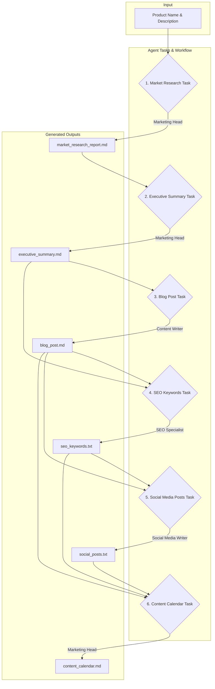

# 🤖 AI Marketing Campaign Orchestrator

Automated marketing content generation powered by CrewAI multi-agent system. Generate comprehensive marketing campaigns from research to social posts in minutes.

[](https://python.org)
[](https://crewai.com)
[](LICENSE)


## 🏗️ System Architecture

graph TD
A[Product Input] --> B[Marketing Head Agent]
B --> C[Market Research]
C --> D[Executive Summary]
D --> E[Blog Writer Agent]
E --> F[SEO Specialist Agent]
F --> G[Social Media Agent]
G --> H[Content Calendar]

text
I[Web Scraper] --> B
J[Search Engine] --> B
K[Cache System] --> B

H --> L[marketing_outputs/]
L --> M[blog_post.md]
L --> N[social_posts.txt]
L --> O[seo_keywords.txt]
L --> P[content_calendar.md]
text

## 🚀 Quick Start

### Installation
git clone https://github.com/AmbujSinghNeo/AI_Marketing_Campaign_Orchestrator.git
cd AI_Marketing_Campaign_Orchestrator
pip install -r requirements.txt

text

### Environment Setup
Create `.env` file:
GROQ_API_KEY_1=your_groq_api_key
GROQ_API_KEY_2=your_groq_api_key
SERPER_API_KEY=your_serper_api_key

text

### Run Campaign Generation
cd main/
python main.py

text

## 📁 Project Structure
```
├── config/
│ ├── agents.yaml # AI agent configurations
│ └── tasks.yaml # Campaign workflow tasks
├── main/
│ ├── main.py # Application entry point
│ └── config.py # Core configurations
├── marketing_outputs/ # Generated content
└── cache/ # API response cache
```
text

## 🎮 Usage Example

**Input:**
crew.kickoff(inputs={
"product_name": "AI Excel Automation Tool",
"product_description": "Automates Excel tasks with AI"
})

text

**Generated Output:**
- **Market Research** (150-200 words)
- **Blog Post** with SEO optimization
- **Social Posts** for LinkedIn & X/Twitter
- **Keywords** for search ranking
- **Content Calendar** for 5-day schedule

## ⚙️ Key Features

| Feature | Description |
|---------|-------------|
| 🧠 **Multi-Agent AI** | 4 specialized agents working collaboratively |
| 🔍 **Smart Research** | Automated web scraping & competitor analysis |
| ✍️ **Content Creation** | SEO-optimized blogs & social posts |
| 📈 **SEO Optimization** | Keyword extraction & search ranking |
| 📅 **Content Planning** | Structured marketing calendars |
| ⚡ **Caching System** | Optimized API usage & cost reduction |

## 🛠️ Tech Stack

- **CrewAI** - Multi-agent orchestration
- **GROQ** - LLM provider (Gemma2-9b-it)
- **Python 3.8+** - Core language
- **YAML** - Configuration management
- **Custom Tools** - Web scraping & search

## 📊 Sample Output

### Generated Blog Post
Revolutionize Your Excel Workflow with AI Automation
Transform repetitive Excel tasks into automated workflows...

✅ 90% time reduction on data processing

✅ Error-free calculations and reporting

✅ Smart data analysis and insights

[Get Started Today →]

text

### Social Media Posts
LinkedIn: Tired of manual Excel work? Our AI tool automates spreadsheet tasks,
saving 10+ hours weekly. Perfect for SMEs! #ExcelAutomation #ProductivityAI

X: Excel automation just got smarter 🤖 Save hours on repetitive tasks with
AI-powered workflows. Built for modern businesses! #Excel #AI

text

## 🤝 Contributing

1. Fork the repository
2. Create feature branch (`git checkout -b feature/new-feature`)
3. Commit changes (`git commit -m 'Add new feature'`)
4. Push to branch (`git push origin feature/new-feature`)
5. Open Pull Request

## 📄 License

MIT License - see [LICENSE](LICENSE) file for details.


# 🤖 AI Marketing Campaign Orchestrator

[](https://www.python.org/downloads/)
[](https://opensource.org/licenses/MIT)
[](https://www.crewai.com/)

This project automates the entire process of creating a marketing campaign using a team of autonomous AI agents. Powered by [CrewAI](https://www.crewai.com/) and accelerated by ultra-fast [Groq](https://groq.com/) LLMs, this orchestrator takes a simple product name and description and generates a comprehensive set of marketing materials.

## 🎯 What It Does

Transform any product idea into a complete marketing campaign:
- **Research** competitors and market opportunities
- **Generate** SEO-optimized blog posts
- **Create** platform-specific social media content  
- **Extract** high-impact keywords
- **Schedule** content in marketing calendars


***

## 📊 Project Workflow

The project follows a sequential workflow where each agent builds upon the work of the previous one, creating a cohesive and context-aware marketing campaign.




***

## ✨ Key Features

* **Autonomous Agent Team**: A crew of four specialized AI agents (Marketing Head, Content Writer, SEO Specialist, Social Media Writer) work together to achieve a common goal.
* **End-to-End Automation**: From initial research to a final, ready-to-use content calendar, the entire workflow is automated.
* **High-Speed Inference**: Leverages Groq's LPU-based inference engine for near-instantaneous content generation, making the process highly efficient.
* **Intelligent Caching**: Includes custom search and scraping tools with a built-in file-based cache to avoid redundant API calls and speed up subsequent runs.
* **Structured & Actionable Outputs**: All generated content is saved in well-organized markdown and text files within the `marketing_outputs` directory.
* **Easy to Configure**: Simply define your product in the `main.py` file and let the crew handle the rest.

***

## ⚙️ How It Works

The system operates like a digital marketing agency's assembly line:
1.  **The Head of Marketing** kicks things off by conducting market research and creating a high-level executive summary.
2.  **The Content Writer** uses the summary to draft a detailed and engaging blog post.
3.  **The SEO Specialist** analyzes the summary and blog post to extract a list of high-impact keywords.
4.  **The Social Media Writer** crafts platform-specific posts (LinkedIn and X/Twitter) using the blog post and keywords for context.
5.  Finally, **The Head of Marketing** returns to assemble all the generated assets into a structured 1-week content calendar.

***

## 🚀 Getting Started

Follow these steps to set up and run the project on your local machine.

### 1. Prerequisites

* Python 3.9 or higher
* Git

### 2. Clone the Repository

```bash
git clone [https://github.com/your-username/AI_Marketing_Campaign_Orchestrator.git](https://github.com/your-username/AI_Marketing_Campaign_Orchestrator.git)
cd AI_Marketing_Campaign_Orchestrator
```

### 3. Install Dependencies

First, create a `requirements.txt` file with the following content:

```txt
crewai
crewai-tools
python-dotenv
requests
beautifulsoup4
langchain-groq
serperdev
# This is for the optional SQLite fix, recommended for some environments
pysqlite3-binary
```

Now, install the required packages:
```bash
pip install -r requirements.txt
```

### 4. Set Up Environment Variables

Create a file named `.env` in the root directory of the project and add your API keys. You will need keys from [Groq](https://console.groq.com/keys) and [Serper](https://serper.dev/api-key).

```ini
# .env file

# Get two API keys from Groq for parallel processing
GROQ_API_KEY_1="gsk_..."
GROQ_API_KEY_2="gsk_..."

# Get your API key from Serper.dev for the search tool
SERPER_API_KEY="YOUR_SERPER_API_KEY"
```

### 5. Run the Orchestrator

Execute the main script to start the marketing campaign creation process:
```bash
python main.py
```

The script will run and you'll find all the generated marketing materials inside the `marketing_outputs` directory.

***

## 📂 Project Structure

```
.
├── main.py                 # The main script to run the crew
├── requirements.txt        # Project dependencies
├── .env                    # Your secret API keys (not committed)
├── marketing_outputs/      # Directory for all generated files
│   ├── blog_post.md
│   ├── content_calendar.md
│   ├── executive_summary.md
│   ├── market_research_report.md
│   ├── seo_keywords.txt
│   └── social_posts.txt
└── cache/                  # Caches search and scrape results
```

***

## 🤝 Contributing

Contributions are welcome! If you have ideas for new features, agents, or improvements, feel free to fork the repository and submit a pull request.

## 🔗 Links

- **Repository**: [GitHub](https://github.com/AmbujSinghNeo/AI_Marketing_Campaign_Orchestrator)
- **Issues**: [Report Bug](https://github.com/AmbujSinghNeo/AI_Marketing_Campaign_Orchestrator/issues)
- **Author**: [AmbujSinghNeo](https://github.com/AmbujSinghNeo)

---

**⭐ Star this repo if it helps your marketing workflow!**


## 📜 License

This project is licensed under the MIT License. See the [LICENSE](https://opensource.org/licenses/MIT) file for details.